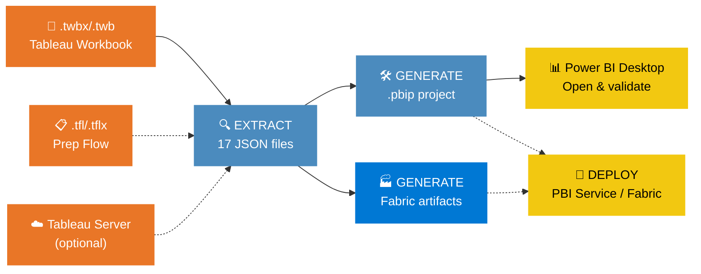
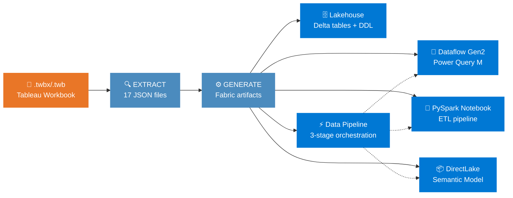
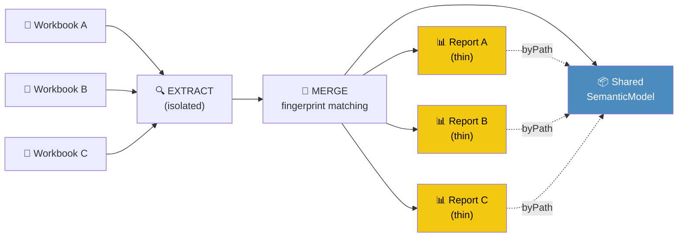
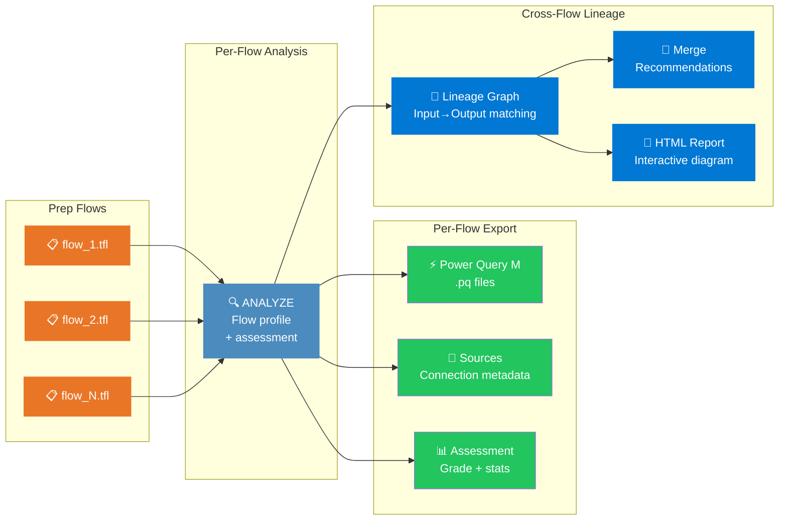
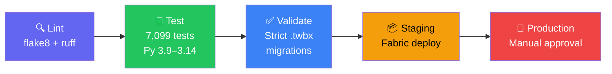

# 🔄 Tableau → Power BI

**Automated Migration Tool** — convert Tableau workbooks (`.twb`/`.twbx`) to Power BI projects (`.pbip`) in seconds, fully automated, zero manual rework.

| | |
|---|---|
| 🏷️ **Version** | 34.0.0 |
| ✅ **Tests** | 8,088 passed · 96.2 % coverage |
| 🐍 **Python** | 3.12+ · zero external dependencies |
| 📜 **License** | MIT |

| 🎯 **Capabilities** | 180+ DAX conversions · 128+ visual types · 79 connectors · 20 object types |

---

## ⚡ Quick Start

```bash
# That's it. One command.
python migrate.py your_workbook.twbx
```

> [!TIP]
> The output is a `.pbip` project (PBIR v4.0) — just double-click to open in **Power BI Desktop** (March 2025 / CY25SU03 or later).

<details>
<summary><b>📦 Installation</b></summary>

```bash
git clone https://github.com/cyphou/Tableau-To-PowerBI.git
cd Tableau-To-PowerBI
python migrate.py your_workbook.twbx
```

**Requirements:** Python 3.12+ • No `pip install` needed — pure standard library.

Optional dependencies:
```bash
pip install azure-identity requests   # Fabric/PBI Service deployment
pip install tableauhyperapi           # .hyper extract file reading (v2+ format)
```
</details>

### More ways to migrate

| Use Case | Command |
|----------|---------|
| 📄 **Single workbook** | `python migrate.py workbook.twbx` |
| 📄 With Prep flow | `python migrate.py workbook.twbx --prep flow.tflx` |
| 📄 Readiness check only | `python migrate.py workbook.twbx --assess` |
| 📁 **Batch (folder)** | `python migrate.py --batch folder/ --output-dir /tmp/out` |
| 📁 Global merge analysis | `python migrate.py --global-assess --batch folder/` |
| ☁️ **Server — single** | `python migrate.py --server URL --workbook "Name" --token-name pat --token-secret secret` |
| ☁️ Server — batch all | `python migrate.py --server URL --server-batch Project --server-assets all --server-preserve-folders ...` |
| 🔗 **Shared model** | `python migrate.py --shared-model wb1.twbx wb2.twbx --model-name "Sales"` |
| 🔗 Merge assessment | `python migrate.py --shared-model wb1.twbx wb2.twbx --assess-merge` |
| 🚀 **Deploy to PBI** | `python migrate.py workbook.twbx --deploy WORKSPACE_ID --deploy-refresh` |
| 🚀 Fabric-native output | `python migrate.py workbook.twbx --output-format fabric` |
| 🌿 **Prep lineage** | `python migrate.py --prep-lineage folder/ flow1.tfl flow2.tfl` |

<details>
<summary><b>More examples</b> (click to expand)</summary>

```bash
# Interactive wizard (guided step-by-step)
python migrate.py workbook.twbx --wizard

# Download only workbooks and datasources from server (flat directory)
python migrate.py --server https://tableau.company.com --server-batch Sales \
    --server-assets workbooks datasources --token-name pat --token-secret secret

# Deploy shared model as bundle to Fabric
python migrate.py --shared-model wb1.twbx wb2.twbx --deploy-bundle WORKSPACE_ID --bundle-refresh

# Deploy an existing shared model project
python migrate.py --deploy-bundle WORKSPACE_ID --output-dir artifacts/shared/MyModel

# Optimize DAX + auto-inject Time Intelligence measures
python migrate.py workbook.twbx --optimize-dax --time-intelligence auto

# Bulk Prep Flow export (Power Query M + sources + lineage, no .pbip)
python migrate.py --batch examples/prep_portfolio/ --output-dir /tmp/prep_output
```

</details>

---

## 🎯 Key Features

<table>
<tr>
<td width="50%">

### 🔄 Complete Extraction
Parses **20 object types** from `.twb`/`.twbx`:
datasources, calculations, worksheets, dashboards, filters, parameters, stories, actions, sets, groups, bins, hierarchies, relationships, sort orders, aliases, custom SQL, custom geocoding, published datasources, data blending, hyper metadata

**Hyper extract data:** `.hyper` files embedded in `.twbx` are automatically converted to CSV and wired into Power Query M expressions via a 3-tier reader chain (`tableauhyperapi` → SQLite → binary scan). Small extracts are inlined directly into `#table()` M partitions; large extracts produce `Csv.Document()` references. Legacy `.tde` files require the `tableauhyperapi` package.

</td>
<td width="50%">

### 🧮 180+ DAX Conversions
Translates Tableau formulas to DAX:
LOD expressions, table calcs, IF/ELSEIF, ISNULL, CONTAINS, window functions, iterators (SUMX), cross-table RELATED/LOOKUPVALUE, RLS security, regex patterns, SPLIT, statistical functions

</td>
</tr>
<tr>
<td>

### 📊 128+ Visual Types
Maps every Tableau mark to Power BI:
bar, line, pie, scatter, map, treemap, waterfall, funnel, gauge, KPI, box plot, word cloud, Sankey, Chord, combo charts, sparklines, and more

</td>
<td>

### 🔌 79 Data Connectors
Generates Power Query M for:
SQL Server, PostgreSQL, BigQuery, Snowflake, Oracle, MySQL, Databricks, SAP HANA, Excel, CSV, SharePoint, Salesforce, Web, OData, Azure Blob, Vertica, Impala, Presto, Fabric Lakehouse, MongoDB, Cosmos DB, Athena, DB2, ServiceNow, Denodo, Essbase, Splunk, and more

</td>
</tr>
<tr>
<td>

### 🧠 Smart Semantic Model
Auto-generates Calendar table, date hierarchies, calculation groups, field parameters, RLS roles, display folders, geographic categories, number formats, perspectives, multi-language cultures

</td>
<td>

### 🚀 Deploy Anywhere
One-command deploy to **Power BI Service** or **Microsoft Fabric** with Azure AD auth (Service Principal / Managed Identity). Gateway config generation included.

</td>
</tr>
<tr>
<td>

### 🏭 Fabric-Native Output
Generate **Lakehouse + Dataflow Gen2 + PySpark Notebook + DirectLake Semantic Model + Data Pipeline** with `--output-format fabric`. Full Fabric project from a single Tableau workbook.

</td>
<td>

### ⚡ DAX Optimizer
`--optimize-dax` rewrites verbose DAX: nested IF→SWITCH, IF(ISBLANK)→COALESCE, constant folding, SUMX simplification. `--time-intelligence auto` auto-injects YTD, PY, YoY% measures.

</td>
</tr>
<tr>
<td>

### 🔍 QA Suite & Auto-Fix
`--qa` runs the full quality assurance pipeline in one shot: validation → auto-fix (17 Tableau→DAX leak patterns) → governance → comparison report → `qa_report.json`. Validator auto-fixes `ISNULL→ISBLANK`, `ZN→IF(ISBLANK)`, `ELSEIF→nested IF`, and more.

</td>
<td>

### 🔗 Lineage Map
Every migration produces a `lineage_map.json` tracking the provenance of every object: Tableau datasource.table → PBI table, Tableau calculation → PBI measure/column, relationships, and worksheet → page mappings. Visualized in the HTML dashboard with flow diagrams, stat cards, and searchable tabbed tables.

</td>
</tr>
<tr>
<td colspan="2">

### 🔗 Shared Semantic Model
Merge multiple Tableau workbooks into **one shared semantic model** with thin reports. Fingerprint-based table matching, Jaccard column overlap scoring, measure conflict resolution, merge assessment with 0–100 scoring, and automatic `byPath` report wiring. **Global assessment** (`--global-assess`) analyzes all workbooks pairwise to find merge clusters and generates an HTML report with a score heatmap matrix. **Fabric bundle deployment** (`--deploy-bundle`) deploys the shared model + thin reports as an atomic unit.

</td>
</tr>
</table>

> [!NOTE]
> **Zero external dependencies** for core migration. The entire engine runs on Python's standard library.

---

## ⚙️ How It Works



**🔍 Step 1 — Extract:** Parses Tableau XML into 17 structured JSON files (worksheets, datasources, calculations, etc.)

**🛠️ Step 2 — Generate:** Converts JSON into a complete `.pbip` project with PBIR v4.0 report and TMDL semantic model

**🚀 Step 3 — Deploy** *(optional):* Packages and uploads to Power BI Service or Microsoft Fabric

### 🏭 Fabric-Native Output Mode

Use `--output-format fabric` to generate a **full Microsoft Fabric project** instead of a `.pbip`:



The pipeline generates **5 Fabric artifacts** from a single Tableau workbook:

| Artifact | Description |
|----------|-------------|
| **Lakehouse** | Delta table schemas, Spark SQL DDL scripts, table metadata |
| **Dataflow Gen2** | Power Query M ingestion queries with Lakehouse destinations |
| **PySpark Notebook** | ETL pipeline (9 connector templates) + transformation notebook |
| **Semantic Model** | DirectLake TMDL pointing to Lakehouse Delta tables |
| **Data Pipeline** | 3-stage orchestration: Dataflow → Notebook → Semantic Model refresh |

```bash
# Generate Fabric-native output
python migrate.py workbook.twbx --output-format fabric

# With custom output directory
python migrate.py workbook.twbx --output-format fabric --output-dir /tmp/fabric_output
```

### 🔗 Shared Semantic Model Mode

When migrating multiple workbooks that share the same data sources, use `--shared-model` to produce **one shared semantic model** + **N thin reports**:



```bash
# Global assessment — identify merge clusters across ALL workbooks
python migrate.py --global-assess --batch examples/tableau_samples/
python migrate.py --global-assess wb1.twbx wb2.twbx wb3.twbx wb4.twbx

# Assess merge feasibility for a specific group
python migrate.py --shared-model wb1.twbx wb2.twbx wb3.twbx --assess-merge

# Generate shared model + thin reports
python migrate.py --shared-model wb1.twbx wb2.twbx wb3.twbx --model-name "Shared Sales"

# Deploy shared model to Fabric workspace as a bundle
python migrate.py --shared-model wb1.twbx wb2.twbx --deploy-bundle WORKSPACE_ID --bundle-refresh

# Deploy an existing shared model project to Fabric
python migrate.py --deploy-bundle WORKSPACE_ID --output-dir artifacts/shared/SharedSales
```

The `--global-assess` flag generates an interactive HTML report with pairwise merge scores, merge clusters, and ready-to-run commands:


### 📋 Tableau Prep Flow Migration

Standalone `.tfl`/`.tflx` Prep flows are migrated **without generating a `.pbip` project** — instead, the tool produces **Power Query M expressions**, **source definitions**, **cross-flow lineage analysis**, and **merge recommendations**.



```bash
# Batch — analyze & export all .tfl files in a folder
python migrate.py --batch examples/prep_portfolio/ --output-dir /tmp/prep_output

# Cross-flow lineage analysis (dedicated mode)
python migrate.py --prep-lineage examples/prep_portfolio/ flow1.tfl flow2.tfl

# Pair a prep flow with a workbook (merge M expressions into .pbip)
python migrate.py workbook.twbx --prep flow.tflx
```

The lineage report shows cross-flow dependencies, merge candidates, and data provenance across your entire Prep portfolio:


<details>
<summary><b>📂 Prep flow batch output</b> (click to expand)</summary>

When running `--batch` on a folder of `.tfl` files, each flow produces:

```
prep_output/
├── 01_Raw_Orders_Clean/
│   ├── PowerQuery/
│   │   └── Orders_Clean.pq              ← Power Query M expression
│   ├── Sources/
│   │   └── Orders_2024.csv.json          ← Source connection metadata
│   └── assessment.json                   ← Grade, inputs, outputs, stats
├── 04_Customer_Enrichment/
│   ├── PowerQuery/
│   │   ├── Customer_360.pq
│   │   └── Demographics.pq
│   ├── Sources/
│   │   ├── CRM Customers.json
│   │   └── Demographics.csv.json
│   └── assessment.json
├── 14_Healthcare_Patient_Flow/
│   ├── PowerQuery/
│   │   ├── Department_KPI_Summary.pq
│   │   ├── Patient_Flow_Detail.pq
│   │   └── Physician_Performance.pq
│   ├── Sources/
│   │   ├── admissions.json
│   │   ├── ICD10_Codes.csv.json
│   │   ├── Procedures.json
│   │   └── Staff_Schedule.xlsx.json
│   └── assessment.json
└── prep_lineage/                         ← Cross-flow lineage (auto-generated)
    ├── prep_lineage_report.html          ← Interactive HTML with Mermaid diagram
    └── prep_lineage.json                 ← Machine-readable lineage graph
```

**Batch summary for prep flows:**

```
  Prep Flow                      Status    Grade   M Queries   Sources
  01_Raw_Orders_Clean                OK    GREEN           1         1
  04_Customer_Enrichment             OK    GREEN           2         2
  09_HR_Attrition_Analysis           OK    GREEN           4         3
  14_Healthcare_Patient_Flow         OK    GREEN           5         4
```

**Mixed directories** (`.twb` + `.tfl`) produce separate summary tables — workbooks get `.pbip` projects with fidelity scores, prep flows get Power Query M + sources + lineage.

</details>
### �📂 Generated Output

```
YourReport/
├── YourReport.pbip                     ← Double-click to open in PBI Desktop
├── migration_metadata.json             ← Stats, fidelity scores, warnings
├── lineage_map.json                    ← Source→target traceability
├── credentials_template.json           ← Datasource credential placeholders
├── YourReport.SemanticModel/
│   └── definition/
│       ├── model.tmdl                  ← Tables, measures, relationships
│       ├── expressions.tmdl            ← Power Query M queries
│       ├── roles.tmdl                  ← Row-Level Security
│       └── tables/
│           ├── Orders.tmdl             ← Columns + DAX measures
│           └── Calendar.tmdl           ← Auto-generated date table
└── YourReport.Report/
    └── definition/
        ├── report.json                 ← Report config + theme
        └── pages/
            └── ReportSection/
                ├── page.json           ← Layout + filters
                └── visuals/
                    └── [id]/visual.json ← Each visual
```

<details>
<summary><b>📂 Shared Semantic Model output</b> (click to expand)</summary>

When using `--shared-model`, the output is a single directory with one shared model and N thin reports:

```
SharedSales/
├── SharedSales.SemanticModel/            ← ONE shared semantic model
│   ├── .platform
│   ├── definition.pbism
│   └── definition/
│       ├── model.tmdl                    ← Merged tables, measures, relationships
│       ├── expressions.tmdl
│       ├── relationships.tmdl
│       └── tables/
│           ├── Orders.tmdl               ← Deduplicated across workbooks
│           ├── Customers.tmdl
│           └── Calendar.tmdl
├── WorkbookA.pbip                        ← Thin report A
├── WorkbookA.Report/
│   ├── definition.pbir                   ← byPath → ../SharedSales.SemanticModel
│   └── definition/
│       └── pages/
├── WorkbookB.pbip                        ← Thin report B
├── WorkbookB.Report/
│   ├── definition.pbir                   ← byPath → ../SharedSales.SemanticModel
│   └── definition/
│       └── pages/
└── merge_assessment.json                 ← Merge score, conflicts, recommendations
```

</details>

---

## 🧮 DAX Conversions (180+ functions)

> **Full reference:** [docs/TABLEAU_TO_DAX_REFERENCE.md](docs/TABLEAU_TO_DAX_REFERENCE.md)

<details>
<summary><b>📋 Complete conversion table</b> (click to expand)</summary>

| Category | Tableau | DAX |
|----------|---------|-----|
| Logic | `IF cond THEN val ELSE val2 END` | `IF(cond, val, val2)` |
| Logic | `IF ... ELSEIF ... END` | `IF(..., ..., IF(...))` |
| Null | `ISNULL([col])` | `ISBLANK([col])` |
| Null | `ZN([col])`, `IFNULL([col], 0)` | `IF(ISBLANK([col]), 0, [col])` |
| Text | `CONTAINS([col], "text")` | `CONTAINSSTRING([col], "text")` |
| Text | `ASCII`, `LEN`, `LEFT`, `RIGHT`, `MID` | `UNICODE`, `LEN`, `LEFT`, `RIGHT`, `MID` |
| Text | `UPPER`, `LOWER`, `REPLACE`, `TRIM` | `UPPER`, `LOWER`, `SUBSTITUTE`, `TRIM` |
| Agg | `COUNTD([col])` | `DISTINCTCOUNT([col])` |
| Agg | `AVG([col])` | `AVERAGE([col])` |
| Date | `DATETRUNC`, `DATEPART`, `DATEDIFF` | `STARTOF*`, `YEAR/MONTH/DAY/etc`, `DATEDIFF` |
| Date | `DATEADD`, `TODAY`, `NOW` | `DATEADD`, `TODAY`, `NOW` |
| Math | `ABS`, `CEILING`, `FLOOR`, `ROUND` | Identical or mapped |
| Stats | `MEDIAN`, `STDEV`, `STDEVP` | `MEDIAN`, `STDEV.S`, `STDEV.P` |
| Stats | `VAR`, `VARP`, `PERCENTILE`, `CORR` | `VAR.S`, `VAR.P`, `PERCENTILE.INC`, `CORREL` |
| Conversion | `INT`, `FLOAT`, `STR`, `DATE` | `INT`, `CONVERT`, `FORMAT`, `DATE` |
| Syntax | `==` | `=` |
| Syntax | `or` / `and` | `\|\|` / `&&` |
| Syntax | `+` (strings) | `&` |
| LOD | `{FIXED [dim] : AGG}` | `CALCULATE(AGG, ALLEXCEPT)` |
| LOD | `{INCLUDE [dim] : AGG}` | `CALCULATE(AGG)` |
| LOD | `{EXCLUDE [dim] : AGG}` | `CALCULATE(AGG, REMOVEFILTERS)` |
| Table Calc | `RUNNING_SUM / AVG / COUNT` | `CALCULATE(SUM/AVERAGE/COUNT)` |
| Table Calc | `RANK`, `RANK_UNIQUE`, `RANK_DENSE` | `RANKX(ALL())` |
| Table Calc | `WINDOW_SUM / AVG / MAX / MIN` | `CALCULATE()` |
| Iterator | `SUM(IF(...))` | `SUMX('table', IF(...))` |
| Iterator | `AVG(IF(...))` / `COUNT(IF(...))` | `AVERAGEX(...)` / `COUNTX(...)` |
| Cross-table | `[col]` other table (manyToOne) | `RELATED('Table'[col])` |
| Cross-table | `[col]` other table (manyToMany) | `LOOKUPVALUE(...)` |
| Security | `USERNAME()` | `USERPRINCIPALNAME()` |
| Security | `FULLNAME()` | `USERPRINCIPALNAME()` |
| Security | `ISMEMBEROF("group")` | `TRUE()` + RLS role per group |

</details>

### Highlights

```
┌─────────────────────────────────────────────────────────────────────────┐
│  Tableau LOD                    →  Power BI DAX                        │
├─────────────────────────────────────────────────────────────────────────┤
│  {FIXED [customer] : SUM([qty] * [price])}                             │
│  → CALCULATE(SUM('T'[qty] * 'T'[price]), ALLEXCEPT('T', 'T'[customer]))│
│                                                                         │
│  {EXCLUDE [channel] : SUM([revenue])}                                   │
│  → CALCULATE(SUM([revenue]), REMOVEFILTERS('T'[channel]))               │
│                                                                         │
│  SUM(IF [status] != "X" THEN [qty] * [price] ELSE 0 END)               │
│  → SUMX('Orders', IF('Orders'[status] != "X", [qty] * [price], 0))     │
│                                                                         │
│  RANK(SUM([revenue]))                                                   │
│  → RANKX(ALL(SUM('Table'[revenue])))                                    │
└─────────────────────────────────────────────────────────────────────────┘
```

---

## 📊 Visual Type Mapping (128+)

<details>
<summary><b>🎨 Full visual mapping table</b> (click to expand)</summary>

| Tableau Mark | Power BI visualType | Notes |
|-------------|-------------------|-------|
| Bar | `clusteredBarChart` | Standard bar |
| Stacked Bar | `stackedBarChart` | |
| Line | `lineChart` | With markers |
| Area | `areaChart` | |
| Pie | `pieChart` | |
| SemiCircle / Donut / Ring | `donutChart` | |
| Circle / Shape / Dot Plot | `scatterChart` | |
| Square / Hex / Treemap | `treemap` | |
| Text | `tableEx` | Table with text |
| Automatic | `table` | Default table |
| Map / Density | `map` | |
| Polygon / Multipolygon | `filledMap` | Choropleth |
| Gantt Bar | `ganttChart` | Custom visual |
| Histogram | `clusteredColumnChart` | |
| Box Plot | `boxAndWhisker` | |
| Waterfall | `waterfallChart` | |
| Funnel | `funnel` | |
| Bullet / Radial / Gauge | `gauge` | |
| Heat Map / Highlight Table | `matrix` | Conditional formatting |
| Packed Bubble / Strip Plot | `scatterChart` | Bubble variant |
| Word Cloud | `wordCloud` | |
| Dual Axis / Combo / Pareto | `lineClusteredColumnComboChart` | |
| Sankey | `sankeyDiagram` | Custom visual GUID |
| Chord | `chordChart` | Custom visual GUID |
| Network | `networkNavigator` | Custom visual GUID |
| KPI | `card` | |
| Image | `image` | |
| 100% Stacked Area | `hundredPercentStackedAreaChart` | |
| Sunburst | `sunburst` | |
| Decomposition Tree | `decompositionTree` | |
| Shape Map | `shapeMap` | |

</details>

---

## 🏗️ Architecture

<details>
<summary><b>📁 Project structure</b> (click to expand)</summary>

```
TableauToPowerBI/
├── migrate.py                                 # CLI entry point (30+ flags)
├── tableau_export/                            # Tableau extraction
│   ├── extract_tableau_data.py                #   TWB/TWBX parser (17 object types)
│   ├── datasource_extractor.py                #   Connection/table/calc extractor
│   ├── dax_converter.py                       #   180+ DAX formula conversions
│   ├── m_query_builder.py                     #   79 connectors + 43 transforms
│   ├── prep_flow_parser.py                    #   Tableau Prep flow parser
│   ├── prep_flow_analyzer.py                  #   Prep flow profiler & assessment
│   ├── hyper_reader.py                        #   .hyper file data loader
│   ├── pulse_extractor.py                     #   Tableau Pulse metric extractor
│   └── server_client.py                       #   Tableau Server REST API client
├── powerbi_import/                            # Power BI generation
│   ├── import_to_powerbi.py                   #   Orchestrator
│   ├── pbip_generator.py                      #   .pbip project + visuals + filters
│   ├── visual_generator.py                    #   128+ visual types, PBIR configs
│   ├── tmdl_generator.py                      #   Semantic model → TMDL
│   ├── dax_optimizer.py                       #   DAX AST optimizer (v25)
│   ├── assessment.py                          #   Pre-migration assessment
│   ├── strategy_advisor.py                    #   Import/DQ/Composite advisor
│   ├── validator.py                           #   Artifact validation
│   ├── equivalence_tester.py                  #   Cross-platform validation (v25)
│   ├── regression_suite.py                    #   Regression snapshot testing (v25)
│   ├── html_template.py                       #   Shared HTML report template (CSS/JS)
│   ├── migration_report.py                    #   Per-item fidelity tracking
│   ├── goals_generator.py                     #   Tableau Pulse → PBI Goals
│   ├── shared_model.py                        #   Multi-workbook merge engine
│   ├── merge_assessment.py                    #   Merge assessment reporter
│   ├── thin_report_generator.py               #   Thin report (byPath) generator
│   ├── prep_lineage.py                        #   Cross-flow lineage graph engine
│   ├── prep_lineage_report.py                 #   Lineage HTML report & merge advisor
│   ├── plugins.py                             #   Plugin system
│   ├── fabric_project_generator.py            #   Fabric-native output (v25)
│   ├── api_server.py                          #   REST API server (v28)
│   ├── schema_drift.py                        #   Schema drift detection (v28)
│   └── deploy/                                #   Deploy to PBI Service / Fabric
├── Dockerfile                                 # Docker image for API server
├── tests/                                     # 8,088 tests across 141+ files
├── docs/                                      # 18 documentation files
└── examples/                                  # Sample Tableau workbooks
```

</details>

---

## 📝 CLI Reference

<details>
<summary><b>🔧 All CLI flags</b> (click to expand)</summary>

| Flag | Description |
|------|-------------|
| `--prep FILE` | Tableau Prep flow (.tfl/.tflx) to merge with a workbook |
| `--prep-lineage PATHS` | Cross-flow lineage analysis for .tfl/.tflx files |
| `--output-dir DIR` | Custom output directory (default: `artifacts/powerbi_projects/`) |
| `--output-format FORMAT` | Output format: `pbip` (default), `tmdl`, or `pbir` |
| `--verbose` / `-v` | Enable verbose (DEBUG) console logging |
| `--quiet` / `-q` | Suppress all output except errors |
| `--log-file FILE` | Write logs to a file |
| `--batch DIR` | Batch-migrate all .twb/.twbx files in a directory |
| `--batch-config FILE` | JSON batch config with per-workbook overrides |
| `--skip-extraction` | Skip extraction, re-use existing datasources.json |
| `--skip-conversion` | Skip DAX/M conversion, re-use existing JSON files |
| `--dry-run` | Preview migration without writing files |
| `--calendar-start YEAR` | Calendar table start year (default: 2020) |
| `--calendar-end YEAR` | Calendar table end year (default: 2030) |
| `--culture LOCALE` | Culture/locale for linguistic metadata (e.g., `fr-FR`) |
| `--mode MODE` | Semantic model mode: `import`, `directquery`, or `composite` |
| `--assess` | Run pre-migration assessment and strategy analysis |
| `--deploy WORKSPACE_ID` | Deploy to Power BI Service workspace |
| `--deploy-refresh` | Trigger dataset refresh after deploy |
| `--rollback` | Backup existing .pbip project before overwriting |
| `--incremental DIR` | Merge changes into existing .pbip |
| `--wizard` | Launch interactive migration wizard |
| `--paginated` | Generate paginated report layout |
| `--config FILE` | Load settings from a JSON configuration file |
| `--telemetry` | Enable anonymous usage telemetry (opt-in) |
| `--compare` | Generate comparison report (HTML) |
| `--dashboard` | Generate telemetry dashboard |
| `--server URL` | Tableau Server/Cloud URL |
| `--site SITE_ID` | Tableau site content URL |
| `--workbook NAME` | Workbook name/LUID to download |
| `--token-name NAME` | PAT name for Tableau Server auth |
| `--token-secret SECRET` | PAT secret for Tableau Server auth |
| `--server-batch PROJECT` | Download all workbooks from a server project |
| `--server-assets TYPE [...]` | Asset types to download: `workbooks`, `flows`, `datasources`, `all` (default: workbooks flows) |
| `--server-preserve-folders` | Mirror Tableau Server project folder structure locally |
| `--languages LOCALES` | Multi-language culture TMDL files (e.g., `fr-FR,de-DE`) |
| `--goals` | Convert Tableau Pulse metrics to PBI Goals |
| `--shared-model WB [WB ...]` | Merge multiple workbooks into one shared semantic model |
| `--model-name NAME` | Name for the shared semantic model (default: `SharedModel`) |
| `--assess-merge` | Only assess merge feasibility for `--shared-model` |
| `--force-merge` | Force merge even if score is below threshold |
| `--strict-merge` | Block generation on merge validation failures (cycles, type errors) |
| `--merge-preview` | Preview merge results without generating output |
| `--global-assess` | Cross-workbook pairwise merge scoring and clustering |
| `--deploy-bundle WS_ID` | Deploy shared model + thin reports as atomic Fabric bundle |
| `--bundle-refresh` | Trigger dataset refresh after bundle deployment |
| `--output-format FORMAT` | Output format: `pbip` (default) or `fabric` (Lakehouse + Dataflow + Notebook + DirectLake) |
| `--optimize-dax` | Run DAX optimizer pass (IF→SWITCH, COALESCE, constant folding) |
| `--time-intelligence MODE` | Auto-inject Time Intelligence measures: `auto` or `none` |
| `--validate-data` | Post-migration data validation (query equivalence) |
| `--composite-threshold COLS` | Per-table StorageMode: tables below threshold → Import, above → DirectQuery |
| `--agg-tables MODE` | Auto-generate aggregation tables: `auto` or `none` |
| `--workers N` | Parallel batch processing with N workers |
| `--sync` | Auto-deploy after incremental change detection |
| `--check-drift DIR` | Compare current extraction against saved snapshot for schema drift |
| `--qa` | Run full QA suite: validate → auto-fix → governance → compare → qa_report.json |
| `--no-optimize-dax` | Disable DAX optimizer (on by default) |
| `--no-compare` | Disable comparison report generation (on by default) |

</details>

---

## 🚀 Deployment

<details>
<summary><b>Power BI Service</b></summary>

```bash
# Set environment variables
export PBI_TENANT_ID="your-tenant-guid"
export PBI_CLIENT_ID="your-app-client-id"
export PBI_CLIENT_SECRET="your-app-secret"

# Migrate + deploy in one command
python migrate.py your_workbook.twbx --deploy WORKSPACE_ID --deploy-refresh
```

Or programmatically:

```python
from powerbi_import.deploy.pbi_deployer import PBIWorkspaceDeployer

deployer = PBIWorkspaceDeployer(workspace_id="your-workspace-guid")
result = deployer.deploy("artifacts/powerbi_projects/MyReport", refresh=True)
```

</details>

<details>
<summary><b>Microsoft Fabric</b></summary>

```bash
export FABRIC_WORKSPACE_ID="your-workspace-guid"
export FABRIC_TENANT_ID="your-tenant-guid"
export FABRIC_CLIENT_ID="your-app-client-id"
export FABRIC_CLIENT_SECRET="your-app-secret"

python -c "
from powerbi_import.deploy.deployer import FabricDeployer
deployer = FabricDeployer(workspace_id='your-workspace-guid')
deployer.deploy_artifacts_batch('artifacts/powerbi_projects/')
"
```

</details>

<details>
<summary><b>Environment configurations</b></summary>

| Environment | Log Level | Retry | Validate | Approval |
|-------------|-----------|-------|----------|----------|
| development | DEBUG | 3 | No | No |
| staging | INFO | 3 | Yes | No |
| production | WARNING | 5 | Yes | Yes |

</details>

---

## ✅ Validation

```python
from powerbi_import.validator import ArtifactValidator

result = ArtifactValidator.validate_project("artifacts/powerbi_projects/MyReport")
# {"valid": True, "files_checked": 15, "errors": []}
```

The validator checks `.pbip` JSON, `report.json`, `model.tmdl`, page/visual structure, and `sortByColumn` cross-references.

---

## 🧪 Testing

```bash
python -m pytest tests/ -v                          # Run all tests
python -m pytest tests/test_dax_converter.py -v      # Run specific file
python -m pytest tests/ --cov --cov-report=html      # Coverage report
```

<details>
<summary><b>📋 Test suite breakdown</b> (click to expand)</summary>

| Test File | Tests | Coverage |
|-----------|-------|----------|
| `test_dax_coverage.py` | 168 | Edge cases across all DAX categories |
| `test_generation_coverage.py` | 145 | TMDL/PBIR generation edge cases |
| `test_m_query_builder.py` | 102 | Power Query M, 40+ transforms |
| `test_tmdl_generator.py` | 92 | Semantic model, Calendar, TMDL |
| `test_dax_converter.py` | 86 | DAX formulas, LOD, table calcs |
| `test_error_paths.py` | 78 | Error handling, graceful degradation |
| `test_sprint_features.py` | 78 | Multi-DS, inference, metadata |
| `test_extract_coverage.py` | 75 | Stories, actions, sets, bins, hierarchies |
| `test_new_features.py` | 74 | Calc groups, field params, M columns |
| `test_v5_features.py` | 72 | v5.x features |
| `test_visual_generator.py` | 65 | 118+ visual types, sync, buttons |
| `test_non_regression.py` | 63 | End-to-end sample workbook migrations |
| `test_prep_flow_parser.py` | 58 | Prep parsing, DAG, step conversion |
| `test_assessment.py` | 55 | Pre-migration (8 categories) |
| + 114 more files | — | Sprint, coverage, layout, E2E, wizard, telemetry… |

</details>

### CI/CD Pipeline



### 📊 Migration Report

After batch migration, run `python generate_report.py` to produce an HTML Migration & Assessment Report with per-workbook fidelity scores:


The report shows for each migrated workbook:
- **Fidelity** — percentage of items migrated successfully (100% = everything converted)
- **Total Items / Exact / Approximate / Unsupported** — breakdown of migration quality per item
- **Tables / Measures / Visuals** — counts of generated artifacts in the output .pbip project

---

## 📚 Documentation

| Document | Description |
|----------|-------------|
| 📖 [Migration Checklist](docs/MIGRATION_CHECKLIST.md) | Step-by-step migration guide |
| 🗺️ [Mapping Reference](docs/MAPPING_REFERENCE.md) | Tableau → Power BI mappings |
| 🔢 [180+ DAX Functions](docs/TABLEAU_TO_DAX_REFERENCE.md) | Complete formula reference |
| ⚡ [108 Power Query M](docs/TABLEAU_TO_POWERQUERY_REFERENCE.md) | Property reference |
| 🔄 [165 Prep → M](docs/TABLEAU_PREP_TO_POWERQUERY_REFERENCE.md) | Prep transformation reference |
| 📋 Prep Flow Lineage | Cross-flow lineage, Power Query M export, merge recommendations (`--batch` / `--prep-lineage`) |
| 🏗️ [Architecture](docs/ARCHITECTURE.md) | System design overview |
| 📊 [.pbip Guide](docs/POWERBI_PROJECT_GUIDE.md) | Output format explained |
| 🚀 [Deployment Guide](docs/DEPLOYMENT_GUIDE.md) | PBI Service & Fabric deploy |
| 📋 [Gap Analysis](docs/GAP_ANALYSIS.md) | Known conversion gaps |
| ⚠️ [Known Limitations](docs/KNOWN_LIMITATIONS.md) | Current limitations |
| 🔧 [Tableau Versions](docs/TABLEAU_VERSION_COMPATIBILITY.md) | Version compatibility |
| ❓ [FAQ](docs/FAQ.md) | Frequently asked questions |
| 🤝 [Contributing](CONTRIBUTING.md) | How to contribute |
| 📝 [Changelog](CHANGELOG.md) | Release history |
| 🔗 [Shared Model Plan](docs/SHARED_SEMANTIC_MODEL_PLAN.md) | Multi-workbook merge architecture |
| � [Enterprise Guide](docs/ENTERPRISE_GUIDE.md) | 8-phase enterprise migration guide |
| 📈 [Roadmap](docs/ROADMAP.md) | Development roadmap |
| 🤖 [Agents](docs/AGENTS.md) | 12-agent specialization model |
| �🌐 Global Assessment | Cross-workbook merge analysis with HTML heatmap (`--global-assess`) |
| 🚀 Bundle Deployment | Deploy shared model + reports to Fabric (`--deploy-bundle`) |

---

## ⚠️ Known Limitations

- `MAKEPOINT()` (spatial) has no DAX equivalent — skipped
- `PREVIOUS_VALUE()` / `LOOKUP()` use OFFSET-based DAX — may need manual tuning
- Data source connection strings must be reconfigured in Power Query after migration
- Some table calculations (`INDEX()`, `SIZE()`) are approximated
- See [docs/KNOWN_LIMITATIONS.md](docs/KNOWN_LIMITATIONS.md) for the full list

---

## 🤝 Contributing

Contributions are welcome! See [CONTRIBUTING.md](CONTRIBUTING.md) for guidelines.

```bash
git clone https://github.com/cyphou/Tableau-To-PowerBI.git
cd Tableau-To-PowerBI
python -m pytest tests/ -q  # Make sure tests pass
```

---

## 📜 License

MIT
