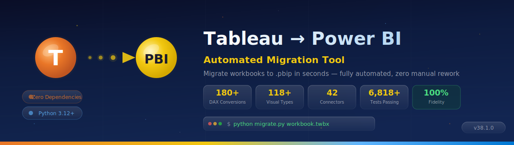

<p align="center">
  
</p>

# Enterprise Deployment Guide

Step-by-step guide for migrating Tableau workbooks to Power BI at enterprise scale (100–500+ workbooks).

## Overview

```
Discovery → Assessment → Wave Planning → Pilot → Batch Migration → Validation → Deployment → Sync
```

## Phase 1: Discovery

1. **Inventory**: Use Tableau Server REST API to list all workbooks
   ```bash
   # Download all asset types (workbooks + flows + datasources), preserving folder structure
   python migrate.py --server https://tableau.company.com \
     --token-name pat --token-secret <secret> \
     --server-batch ALL --server-assets all --server-preserve-folders \
     --output-dir /tmp/inventory

   # Or download only workbooks (default behavior)
   python migrate.py --server https://tableau.company.com \
     --token-name pat --token-secret <secret> \
     --server-batch ALL --output-dir /tmp/inventory
   ```

2. **Global Assessment**: Analyze all workbooks for overlap and complexity
   ```bash
   python migrate.py --global-assess --batch /path/to/workbooks/
   ```
   This generates:
   - Pairwise merge score matrix (N×N heatmap)
   - Merge clusters (shared data patterns)
   - Per-workbook complexity scores

## Phase 2: Assessment

1. **Server Assessment**: Score each workbook RED/YELLOW/GREEN
   ```bash
   python migrate.py --batch /path/to/workbooks/ --assess
   ```

2. **Strategy Advisor**: Get Import/DirectQuery/Composite recommendations
   ```bash
   python migrate.py workbook.twbx --assess
   ```

3. **Governance Report**: Executive summary for leadership
   - Total workbooks, migration waves, estimated effort
   - Risk matrix, recommended sequence

## Phase 3: Wave Planning

Workbooks are automatically grouped into 3 waves:

| Wave | Criteria | Typical Effort |
|------|----------|----------------|
| Easy (quick wins) | GREEN, low complexity | 1–4 hours each |
| Medium (standard) | YELLOW, moderate complexity | 4–12 hours each |
| Complex (manual review) | RED, high complexity | 12–40+ hours each |

**Resource Allocation** (based on `plan_resource_allocation()`):
- Easy wave: All visual designers (no DAX/M expertise needed)
- Medium wave: 1 DAX expert + visual designers
- Complex wave: 1 DAX expert + 1 M expert + visual designers

## Phase 4: Pilot Migration

1. Select 3–5 representative workbooks from Easy wave
2. Migrate with full validation:
   ```bash
   python migrate.py pilot1.twbx --output-dir artifacts/pilot/ --verbose
   ```
3. Open in Power BI Desktop, verify visuals
4. Deploy to a test workspace:
   ```bash
   python migrate.py pilot1.twbx --deploy WORKSPACE_ID --deploy-refresh
   ```

## Phase 5: Batch Migration

```bash
# Sequential (safe)
python migrate.py --batch /workbooks/ --output-dir /output/ --verbose

# Parallel (faster, for 100+ workbooks)
python migrate.py --batch /workbooks/ --output-dir /output/ --workers 4

# With resume (restart-safe)
python migrate.py --batch /workbooks/ --output-dir /output/ --workers 4 --resume
```

### Shared Semantic Model

For workbooks sharing data, consolidate into a shared model:
```bash
python migrate.py --shared-model wb1.twbx wb2.twbx --model-name "Shared Sales"
```

### Composite Model

For large tables, use composite mode:
```bash
python migrate.py workbook.twbx --mode composite --composite-threshold 10 --agg-tables auto
```

### Tableau Prep Flow Migration

If your organization has standalone Prep flows (.tfl/.tflx), migrate them separately — they produce Power Query M expressions, source definitions, and cross-flow lineage (not `.pbip` projects):

```bash
# Batch export all Prep flows — produces M queries, sources & lineage
python migrate.py --batch /prep_flows/ --output-dir /output/prep/

# Cross-flow lineage analysis
python migrate.py --prep-lineage /prep_flows/

# Pair a prep flow with a workbook for merged .pbip output
python migrate.py workbook.twbx --prep flow.tfl
```

The cross-flow lineage report identifies chain dependencies, merge candidates, and data provenance across all flows in your portfolio.

## Phase 6: Validation

```bash
# Validate all generated projects
python migrate.py --batch /output/ --check-schema

# Visual diff report
python migrate.py workbook.twbx --visual-diff
```

## Phase 7: Deployment

### Single Workbook
```bash
python migrate.py workbook.twbx --deploy WORKSPACE_ID --deploy-refresh
```

### Bundle Deployment (Shared Model + Thin Reports)
```bash
python migrate.py --shared-model wb1.twbx wb2.twbx \
  --deploy-bundle WORKSPACE_ID --bundle-refresh
```

### Multi-Tenant
```bash
python migrate.py --shared-model wb1.twbx wb2.twbx \
  --multi-tenant tenants.json
```

### REST API (Docker)

For headless/programmatic migrations, use the REST API server:
```bash
docker build -t tableau-to-pbi .
docker run -p 8000:8000 tableau-to-pbi
# POST workbooks via /migrate endpoint for headless batch processing
```

Endpoints: `POST /migrate`, `GET /status/{id}`, `GET /download/{id}`, `GET /health`, `GET /jobs`.

## Phase 8: Live Sync

Keep migrated artifacts in sync with evolving Tableau workbooks:
```bash
python migrate.py --batch /workbooks/ --output-dir /output/ --sync
```

The `--sync` flag:
1. Detects changed workbooks (via Server API `updatedAt`)
2. Re-extracts only modified workbooks
3. Generates incremental diffs
4. Deploys updated artifacts

### Schema Drift Detection

Compare a workbook against a previously saved extraction baseline:
```bash
python migrate.py workbook.twbx --check-drift /path/to/snapshot_dir
```

Detects added/removed/changed tables, columns, calculations, worksheets, relationships, parameters, and filters. Saves JSON drift report and updated baseline.

## Performance Guidelines

| Scale | Workers | Expected Time | RAM |
|-------|---------|--------------|-----|
| 10 workbooks | 1 | ~2 min | <200MB |
| 50 workbooks | 2 | ~5 min | <300MB |
| 100 workbooks | 4 | ~8 min | <500MB |
| 500 workbooks | 4–8 | ~30 min | <1GB |

## Monitoring

Enable telemetry for migration observability:
```bash
export TTPBI_TELEMETRY=1
python migrate.py --batch /workbooks/ --output-dir /output/
```

View the telemetry dashboard:
```python
from powerbi_import.telemetry_dashboard import generate_dashboard
generate_dashboard(log_path='~/.ttpbi_telemetry.json', output='dashboard.html')
```
